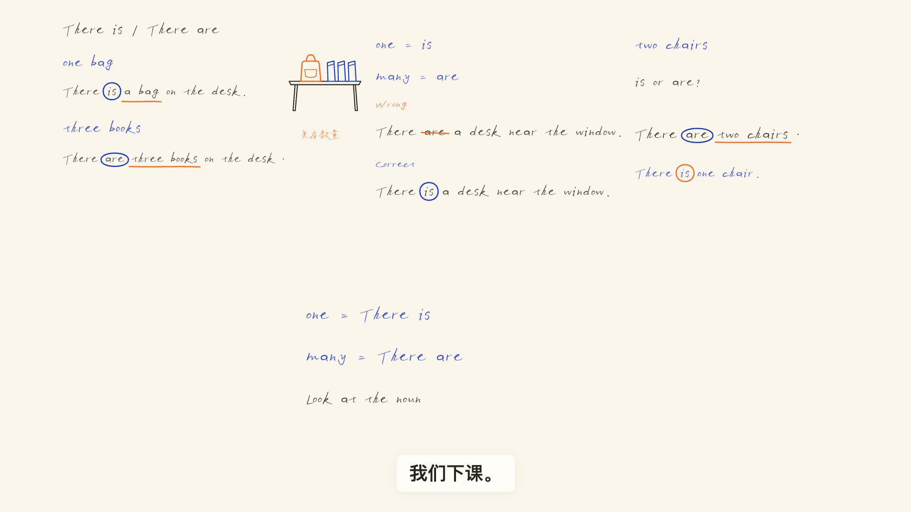

# English Grammar to Video

让枯燥的英语语法，变成有趣的手写板书小课。

English Grammar to Video 是一款英语语法视频创作 Skill，帮你把抽象的语法概念，讲成有情境、有板书、有声音的视频小课。

在你熟悉的 Agent 中安装后，只需用自然语言告诉它：想讲什么、讲给谁听。它就会确定课程范围、撰写讲稿、安排简笔画与板书，配上中文讲解和英语例句，最后输出约两分钟的 16:9 横屏 MP4 视频。你也可以指定课程时长，选择男声或女声。

## 看看能做出什么

男声小课案例：《There is / There are》——通过桌上的书包和书本，讲清楚什么时候用 is，什么时候用 are。

https://github.com/user-attachments/assets/f823cdec-967f-4d33-81cb-6b999028619f

[下载示例视频](media/there-is-are-male-demo-no-writing-sfx.mp4)

| 情境简图 | 重点圈注 | 结尾总览 |
| --- | --- | --- |
|  |  |  |

以上画面来自《There is / There are》小课。

## 怎么安装

这是在**本地运行**的 Skill。安装时保留仓库内 `SKILL.md`、`grammar_video.py`、`runtime/`、`assets/`、`references/` 的相对位置。把下面对应的一段复制给你的 Agent；安装后它会检查并完成首次环境准备，再告诉你是否可以开始制作。其他 Agent 同样需要文件读写、命令执行与必要的联网能力；列出安装提示不表示本项目已在这些宿主完成集成验证。

首次准备会下载约 2.52 GB 的 Qwen3-TTS 0.6B Base 模型及相关依赖；已有匹配的缓存会复用。下列提示已要求 Agent 完成这些准备，遇到权限或真实阻塞时再说明必要操作。

**Codex** · [官方 Skills 说明](https://learn.chatgpt.com/docs/build-skills)

```text
请用 $skill-installer 从 https://github.com/ryanchenxr/english-grammar-to-video 的仓库根目录安装 English Grammar to Video Skill，保留完整目录结构。

读取 SKILL.md 和 references/setup-and-cli.md，选择或复用安装目录之外的独立制作工作区，记录其完整路径并始终使用同一路径。运行 doctor；若为 needs-preparation，按说明自主补齐必要系统依赖，执行 prepare --voice-route fixed-reference --model-source modelscope --download-model，安装隔离依赖并下载匹配的 Qwen3-TTS 0.6B Base，复用已有兼容依赖和模型。再次运行 doctor，确认 ready 并检查渲染浏览器可用后，报告是否可以开始制作，不停在报告缺项。遇到系统权限、宿主授权或真实阻塞时说明原因，只给最少必要操作，不绕过权限、不关闭安全保护、不让用户拼接命令或猜路径。本次只完成安装准备，不生成课程。
```

**Claude Code** · [官方 Skills 说明](https://code.claude.com/docs/en/skills)

```text
请把 https://github.com/ryanchenxr/english-grammar-to-video 的完整仓库安装为我的 Claude Code 本地个人 Skill，名称为 english-grammar-to-video，确保 SKILL.md 在该 Skill 目录根部。

读取 SKILL.md 和 references/setup-and-cli.md，选择或复用安装目录之外的独立制作工作区，记录其完整路径并始终使用同一路径。运行 doctor；若为 needs-preparation，按说明自主补齐必要系统依赖，执行 prepare --voice-route fixed-reference --model-source modelscope --download-model，安装隔离依赖并下载匹配的 Qwen3-TTS 0.6B Base，复用已有兼容依赖和模型。再次运行 doctor，确认 ready 并检查渲染浏览器可用后，报告是否可以开始制作，不停在报告缺项。遇到系统权限、宿主授权或真实阻塞时说明原因，只给最少必要操作，不绕过权限、不关闭安全保护、不让用户拼接命令或猜路径。本次只完成安装准备，不生成课程。
```

Claude Code 是能访问本机文件和终端的编程工具；普通 Claude 网页聊天不能照此运行本地视频制作命令。

**WorkBuddy** · [官方技能安装说明](https://cloud.tencent.com/document/product/1831/134432)

```text
请从 https://github.com/ryanchenxr/english-grammar-to-video 获取完整的 English Grammar to Video Skill，并按 WorkBuddy 的“上传技能／导入本地技能包”方式安装。保留 SKILL.md、程序与资源的相对位置；若导入需要我手动点击，请准备好技能包并告诉我入口。

读取 SKILL.md 和 references/setup-and-cli.md，选择或复用安装目录之外的独立制作工作区，记录其完整路径并始终使用同一路径。运行 doctor；若为 needs-preparation，按说明自主补齐必要系统依赖，执行 prepare --voice-route fixed-reference --model-source modelscope --download-model，安装隔离依赖并下载匹配的 Qwen3-TTS 0.6B Base，复用已有兼容依赖和模型。再次运行 doctor，确认 ready 并检查渲染浏览器可用后，报告是否可以开始制作，不停在报告缺项。遇到系统权限、宿主授权或真实阻塞时说明原因，只给最少必要操作，不绕过权限、不关闭安全保护、不让用户拼接命令或猜路径。本次只完成安装准备，不生成课程。
```

**DeepSeek Harness** · [官方介绍](https://www.deepseek.com/harness/)

```text
请先确认你当前 DeepSeek Harness 使用的本地 Skill 机制和安装位置，再从 https://github.com/ryanchenxr/english-grammar-to-video 读取并安装完整的 English Grammar to Video Skill。保留 SKILL.md 与程序资源的相对位置；若当前 Harness 无法安装或运行本地 Skill，请说明限制，不猜测目录。

读取 SKILL.md 和 references/setup-and-cli.md，选择或复用安装目录之外的独立制作工作区，记录其完整路径并始终使用同一路径。运行 doctor；若为 needs-preparation，按说明自主补齐必要系统依赖，执行 prepare --voice-route fixed-reference --model-source modelscope --download-model，安装隔离依赖并下载匹配的 Qwen3-TTS 0.6B Base，复用已有兼容依赖和模型。再次运行 doctor，确认 ready 并检查渲染浏览器可用后，报告是否可以开始制作，不停在报告缺项。遇到系统权限、宿主授权或真实阻塞时说明原因，只给最少必要操作，不绕过权限、不关闭安全保护、不让用户拼接命令或猜路径。本次只完成安装准备，不生成课程。
```

## 怎么开始

安装和环境准备完成后，直接对 Agent 说：

> 调用 English Grammar to Video Skill，给初中生讲现在进行时，约两分钟，使用男声。

然后，你的 Agent 就会根据要求，为你生成对应的视频小课。

## 需要什么

| 你先准备 | 程序会准备 |
| --- | --- |
| 本地 Agent 的文件读写、命令执行和联网权限；Node.js/npm、FFmpeg、Chrome/Chromium，以及 Python 3.12 或可用于启动程序并建立 Python 3.12 环境的 `uv`。 | `doctor` 检查环境；`prepare` 在独立工作区安装 Python/Node 依赖，并按需下载官方 Qwen3-TTS 0.6B Base 模型。 |
| 首次下载需要联网、足够磁盘空间与内存。Base 模型仓库约 2.52 GB。 | 模型统一缓存，不为每门课复制。本地配音不调用付费语音 API；所用 Agent 的订阅或模型 API、网络、电力与硬件可能产生费用。 |

缺少系统程序时，可以让具备权限的 Agent 协助安装；现有 `prepare` 只负责工作区内的隔离依赖和模型，不安装 Node.js、FFmpeg 或浏览器。

`prepare` 当前提供 macOS 与 Windows 路径；其他系统能否运行请先让 Agent 检查。首次准备的具体命令和仅有 `uv` 时的启动方式见[环境准备与命令](references/setup-and-cli.md)。

## 常用调整

| 想调整 | 怎么说 |
| --- | --- |
| 时长与受众 | “讲给初中生听，控制在 90 秒左右。”明确时长优先。 |
| 男女声 | 默认女声；在需求中说“使用男声”即可。首次更换音色时先听短样。 |
| 字体 | 默认已内置；想更换时把有权使用的字体文件交给 Agent。 |
| 输出位置 | 告诉 Agent 你希望把生成的视频保存到哪里。 |

## 技术文档、许可与致谢

- [环境准备与命令](references/setup-and-cli.md) · [课程数据格式](references/course-format.md) · [固定音色配置](references/voice-profile.md)
- [MIT 许可证](LICENSE)适用于本项目原创源码与文档；[声音素材说明](VOICE_ASSETS.md)列明两份参考的来源和授权用途。字体与第三方组件沿用各自条款，详见[依赖许可与来源](references/licenses-and-sources.md)。
- 板书默认使用「字制区喜脉喜欢体」，已获字体作者喜脉授权，随本项目提供，用户可免费用于个人及商业视频创作，无需额外支付字体使用费用。你也可以根据喜好更换其他字体，所选字体按其自身授权使用。
- 结构化分镜与检查工作流参考柳伟杰 Liu Weijie（Finderchangchang）的 [BrewReel](https://github.com/Finderchangchang/brewreel)；本项目未复制其源码或素材。
- 视频形式参考 Leon.X。
